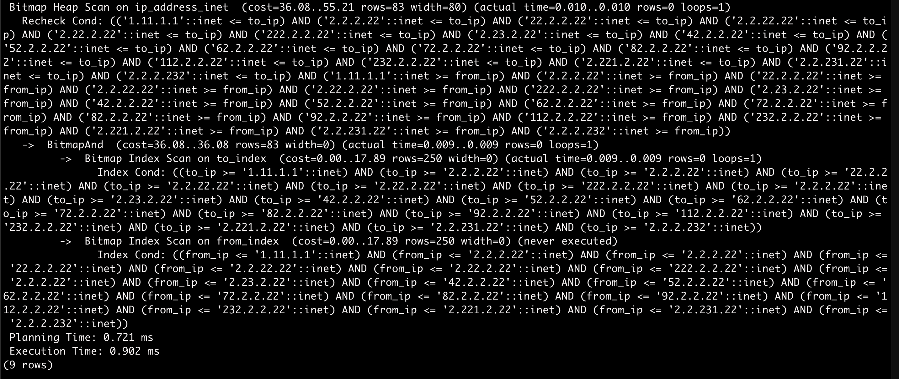
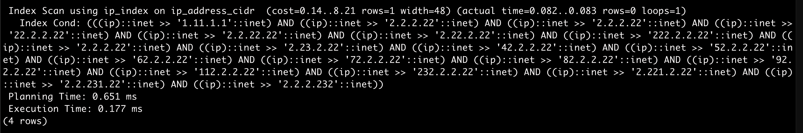

PostgresではIPアドレスのデータ型に`inet`と`cidr`の二種類がある。テーブルに登録されているIPアドレスの範囲を検索するのにどちらが性能面で適しているかを簡単に確認してみた。

## 結果

先に結果を書くと、`cidr`の方が実行計画上は優れていました。

## 実行計画の見方

https://tech-blog.rakus.co.jp/entry/20200612/postgreSQL

## inet

```sql
EXPLAIN ANALYZE SELECT * FROM ip_address_inet
WHERE 
    '1.11.1.1' BETWEEN from_ip AND to_ip
    AND '2.2.2.22' BETWEEN from_ip AND to_ip
    AND '2.2.2.22' BETWEEN from_ip AND to_ip
    AND '22.2.2.22' BETWEEN from_ip AND to_ip
    AND '2.2.22.22' BETWEEN from_ip AND to_ip
    AND '2.22.2.22' BETWEEN from_ip AND to_ip
    AND '222.2.2.22' BETWEEN from_ip AND to_ip
    AND '2.2.2.22' BETWEEN from_ip AND to_ip
    AND '2.23.2.22' BETWEEN from_ip AND to_ip
    AND '42.2.2.22' BETWEEN from_ip AND to_ip
    AND '52.2.2.22' BETWEEN from_ip AND to_ip
    AND '62.2.2.22' BETWEEN from_ip AND to_ip
    AND '72.2.2.22' BETWEEN from_ip AND to_ip
    AND '82.2.2.22' BETWEEN from_ip AND to_ip
    AND '92.2.2.22' BETWEEN from_ip AND to_ip
    AND '112.2.2.22' BETWEEN from_ip AND to_ip
    AND '232.2.2.22' BETWEEN from_ip AND to_ip
    AND '2.221.2.22' BETWEEN from_ip AND to_ip
    AND '2.2.231.22' BETWEEN from_ip AND to_ip
    AND '2.2.2.232' BETWEEN from_ip AND to_ip
;
```

[](./inet_explain.png)

from_ipとto_ipにGiSTでindexを作成しています。

## cidr

```sql
EXPLAIN ANALYZE SELECT * FROM ip_address_cidr
WHERE 
    '1.11.1.1' << ip
    AND '2.2.2.22' << ip
    AND '2.2.2.22' << ip
    AND '22.2.2.22' << ip
    AND '2.2.22.22' << ip
    AND '2.22.2.22' << ip
    AND '222.2.2.22' << ip
    AND '2.2.2.22' << ip
    AND '2.23.2.22' << ip
    AND '42.2.2.22' << ip
    AND '52.2.2.22' << ip
    AND '62.2.2.22' << ip
    AND '72.2.2.22' << ip
    AND '82.2.2.22' << ip
    AND '92.2.2.22' << ip
    AND '112.2.2.22' << ip
    AND '232.2.2.22' << ip
    AND '2.221.2.22' << ip
    AND '2.2.231.22' << ip
    AND '2.2.2.232' << ip
;
```

[](./cidr_explain.png)

ipにGiSTでindexを作成しています。
